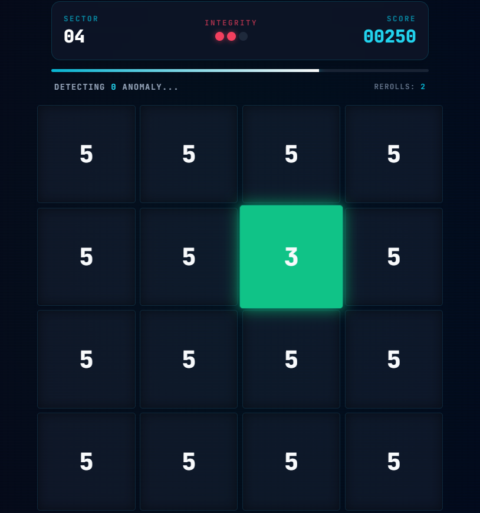
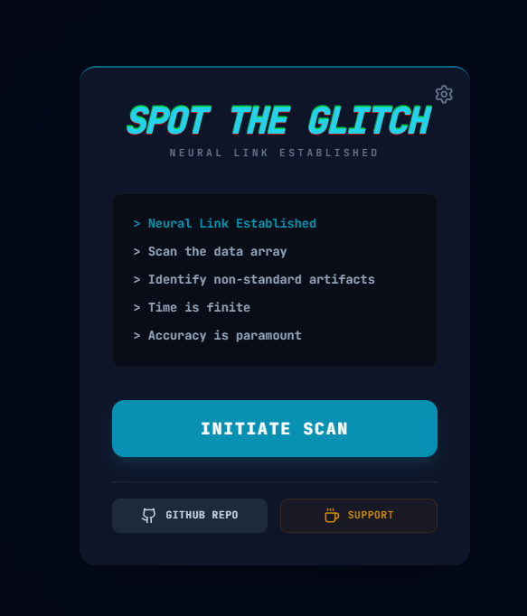
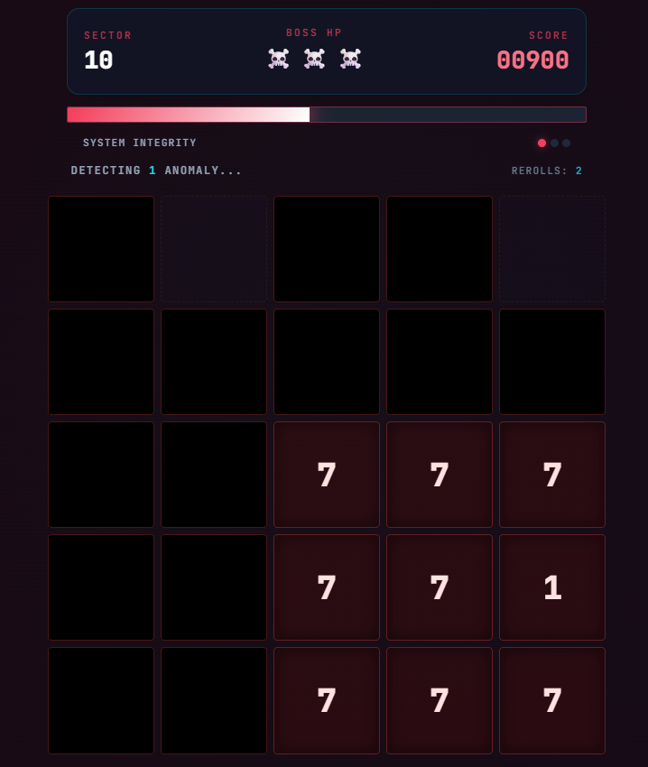
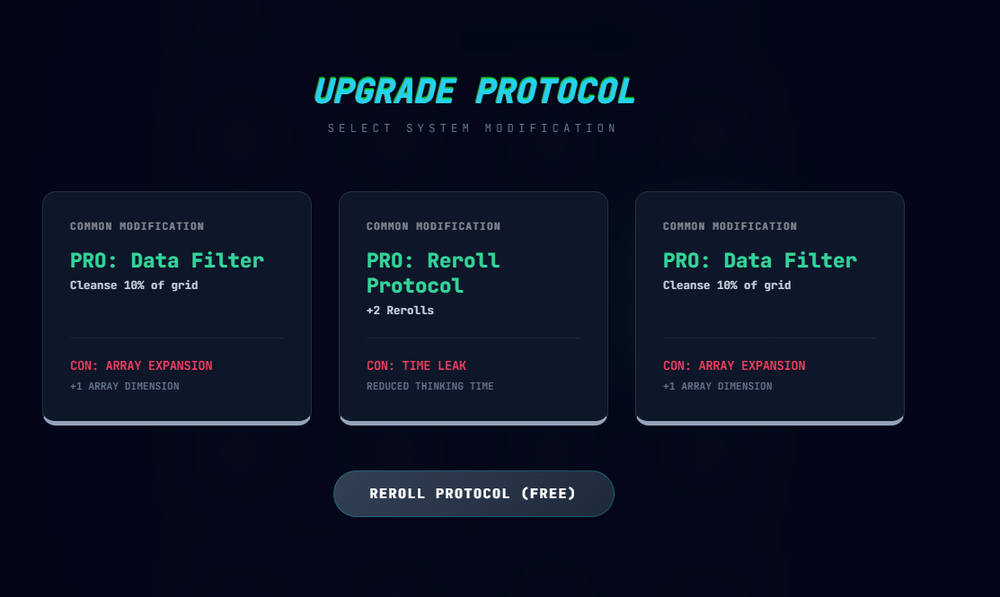

# Spot-The-Glitch

**Spot the Glitch** is a high-speed, roguelike perception puzzle game. The player acts as a digital auditor scanning data arrays for "corrupted" artifacts. The game blends the simplicity of "Odd One Out" puzzles with the strategic depth of a roguelike deck-builder.

> *Note: Place your screenshots in a `screenshots` folder in the root directory.*

## Features

- **High-Speed Perception:** Rapidly identify the anomalous character in a grid of alphanumeric data.
- **Roguelike Progression:** Earn points to level up and visit the **Protocol Shop** every 5 levels.
- **Deck-Building Strategy:** Choose upgrades that boost your cleansing power, time limits, or grid size—but beware of usage costs!
- **Boss Battles:** Every 25 levels (plus Level 10), face off against unique bosses like **The Void** (Fog of War) or **The Blinker** (Visual Strobe).
- **Artifact System:** Defeating bosses grants powerful artifacts (e.g., *Quantum Lens*, *Auto Patcher*) that passively aid your run.
- **Dynamic Difficulty:** The grid grows, time shrinks, and anomalies become subtler as you survive deeper into the system.

## Mechanics

- **Thinking Time:** A rapidly depleting timer forces quick decisions. Finding a glitch resets the timer (or extends it in Boss Mode).
- **Integrity (Lives):** Clicking a normal cell damages your system. Lose all integrity, and the session ends.
- **Boss Modes:**
  - **The Void:** Obscures the grid; hover to reveal sectors.
  - **The Shifter:** Shuffles the grid every few seconds.
  - **The Blinker:** Grid fades in and out of visibility.
  - **The Virus:** Anomalies multiply over time—find the original!

## Screenshots

| Start Screen | Boss Battle | Shop Interface |
|:---:|:---:|:---:|
|  |  |  |

## Development

This project was built with:
- **React 18** (Vite)
- **Tailwind CSS**
- **Web Audio API** (Procedural Sound Engine)

## Credits

Created by [shadowxdgamer](https://github.com/shadowxdgamer).

[Buy Me A Coffee](https://buymeacoffee.com/shadowxdgamer)